# 500+ AI · ML · Optimisation · Energy Intelligence Projects

[](https://github.com/Harrypatria)
[](LICENSE)
[](CONTRIBUTING.md)
[](#energy-intelligence-hub)
[](#method-clusters)
[](#contributing)
[](https://orcid.org/0000-0002-7844-538X)
[](https://www.patriaco.co.uk)

---

## Abstract

The energy sector is undergoing a fundamental transformation driven by the convergence of artificial intelligence, machine learning, and advanced optimisation techniques. This repository curates 500+ production-grade open-source projects spanning agentic AI systems, retrieval-augmented generation, reinforcement learning for grid control, physics-informed neural networks, and graph neural networks applied to power infrastructure.

Key industry trends shaping this collection include the rise of foundation models for universal time-series forecasting (Chronos, TimesFM), multi-agent reinforcement learning for decentralised energy dispatch, LLM-guided optimisation for unit commitment and economic dispatch, and digital twin architectures integrating real-time sensor fusion with predictive maintenance. Battery management systems increasingly rely on physics-informed ML, while demand response programmes leverage multi-agent coordination under uncertainty.

Organised by technical method rather than industry sector, this resource enables practitioners to select proven algorithms for specific problems — from NILMTK's non-intrusive load monitoring to Grid2Op's power grid RL environment. Every entry is verified against 100+ GitHub stars, ensuring community-validated quality. Aligned with the net-zero transition, this repository prioritises carbon-aware computing, renewable integration, and smart grid intelligence as foundational pillars of the AI-enabled energy future.

---

## Repository Architecture Diagram

```mermaid
graph TD
    ROOT["500+ AI · ML · Optimisation\nEnergy Intelligence Projects"]

    ROOT --> A["⚡ Energy Intelligence\n82 repos"]
    ROOT --> B["🤖 Agentic AI\n74 repos"]
    ROOT --> C["🔍 RAG & LLMs\n61 repos"]
    ROOT --> D["📈 Optimisation & OR\n53 repos"]
    ROOT --> E["🧬 Reinforcement Learning\n52 repos"]
    ROOT --> F["🕸 Graph & Network AI\n43 repos"]
    ROOT --> G["🔮 Forecasting & TS\n51 repos"]
    ROOT --> H["🏭 Digital Twins\n34 repos"]

    A --> A1["Demand Forecasting\nDarts · Prophet · TimesFM"]
    A --> A2["Grid Optimisation\nPyPSA · Pyomo · CVXPY"]
    A --> A3["RL for Grids\nGrid2Op · CityLearn · Sinergym"]
    A --> A4["Battery & EV\nPyBaMM · BatteryML · EV2Gym"]
    A --> A5["Fault Detection\nPyOD · Merlion · Anomaly-T"]
    A --> A6["Renewables\nPVLib · Open-Meteo"]
    A --> A7["Carbon & Net-Zero\nElectricityMaps · CarbonTracker"]

    B --> B1["CrewAI\nFlows · Crews · Tools"]
    B --> B2["AutoGen\nCore · Magentic-One"]
    B --> B3["LangGraph\nPlan-Execute · Reflection"]
    B --> B4["Agno\nFinance · Research · Legal"]
    B --> B5["Standalone\nBabyAGI · MetaGPT · SuperAGI"]

    C --> C1["Core RAG\nAdaptive · CRAG · Self-RAG"]
    C --> C2["Graph RAG\nGraphRAG · RAPTOR · Neo4j"]
    C --> C3["Chatbots\nPrivateGPT · Ollama · Rasa"]

    D --> D1["Mathematical\nPuLP · OR-Tools · Pyomo"]
    D --> D2["Metaheuristics\nDEAP · Pymoo · PySwarms"]
    D --> D3["LLM-guided OR\nOptiGuide · Gurobi-ML"]

    E --> E1["Libraries\nSB3 · RLlib · CleanRL"]
    E --> E2["Energy Envs\nGrid2Op · CityLearn · PowerGym"]
    E --> E3["Finance RL\nFinRL · FinGPT"]

    F --> F1["GNN Frameworks\nPyG · DGL"]
    F --> F2["Graph Analysis\nNetworkX · iGraph"]
    F --> F3["Knowledge Graphs\nGraphRAG · Neo4j GenAI"]

    G --> G1["Foundation Models\nTimesFM · Chronos · Moirai"]
    G --> G2["Libraries\nDarts · sktime · StatsForecast"]
    G --> G3["Anomaly Detection\nPyOD · Merlion · Anomaly-T"]

    H --> H1["Physics-Informed\nPINNs · PyBaMM"]
    H --> H2["Simulation\nEnergyPlus · Sinergym"]
    H --> H3["Cloud Twins\nAzure Digital Twins"]

    style ROOT fill:#1e1b4b,color:#fff,stroke:#6366f1,stroke-width:2px
    style A fill:#78350f,color:#fef3c7,stroke:#f59e0b
    style B fill:#312e81,color:#e0e7ff,stroke:#6366f1
    style C fill:#064e3b,color:#d1fae5,stroke:#10b981
    style D fill:#1e3a8a,color:#dbeafe,stroke:#3b82f6
    style E fill:#500724,color:#fce7f3,stroke:#ec4899
    style F fill:#3b0764,color:#f3e8ff,stroke:#8b5cf6
    style G fill:#134e4a,color:#ccfbf1,stroke:#14b8a6
    style H fill:#431407,color:#ffedd5,stroke:#f97316
```



---

## Method-Problem Decision Matrix


---

## Framework Dependency Map

```mermaid
graph LR
    LLM["LLM Backbone\nGPT-4o · Claude · Llama"]

    LLM --> LC["LangChain"]
    LLM --> LI["LlamaIndex"]
    LLM --> CR["CrewAI"]
    LLM --> AG["AutoGen"]
    LLM --> LG["LangGraph"]
    LLM --> AN["Agno"]

    LC --> RAG["RAG Pipelines"]
    LI --> RAG
    LG --> AGENTS["Stateful Agents"]
    CR --> AGENTS
    AG --> AGENTS
    AN --> AGENTS

    RAG --> VDB["Vector DB\nChroma · Pinecone · Weaviate"]
    AGENTS --> TOOLS["Tool Layer\nSearch · Code · APIs"]

    TOOLS --> ENERGY["Energy Domain\nGrid2Op · PyPSA · PVLib"]
    TOOLS --> OPT["Optimisation\nOR-Tools · Pyomo · CVXPY"]
    TOOLS --> DATA["Data Layer\nDarts · sktime · GluonTS"]

    style LLM fill:#1e1b4b,color:#fff,stroke:#6366f1
    style ENERGY fill:#78350f,color:#fef3c7,stroke:#f59e0b
    style OPT fill:#1e3a8a,color:#dbeafe,stroke:#3b82f6
    style DATA fill:#134e4a,color:#ccfbf1,stroke:#14b8a6
```



---

## Table of Contents

- [Method Clusters](#method-clusters)
- [Energy Intelligence Hub](#energy-intelligence-hub)
- [Agentic AI and Multi-Agent Systems](#agentic-ai-and-multi-agent-systems)
- [RAG and Retrieval-Augmented Generation](#rag-and-retrieval-augmented-generation)
- [Optimisation and Operations Research](#optimisation-and-operations-research)
- [Reinforcement Learning](#reinforcement-learning)
- [Graph and Network AI](#graph-and-network-ai)
- [Forecasting and Time-Series Modelling](#forecasting-and-time-series-modelling)
- [Digital Twins and Simulation](#digital-twins-and-simulation)
- [ML Frameworks and Agentic Platforms](#ml-frameworks-and-agentic-platforms)
- [Related Repositories by the Author](#related-repositories-by-the-author)
- [Contributing](#contributing)
- [Star History](#star-history)

---

## Method Clusters

| Cluster | Projects | Core Methods |
|---------|----------|-------------|
| Energy Intelligence | 82 | Demand forecasting, grid optimisation, battery ML, fault detection |
| Agentic AI | 74 | CrewAI, AutoGen, LangGraph, Agno, BabyAGI |
| RAG & LLMs | 61 | Adaptive, Corrective, Self-RAG, GraphRAG, HyDE |
| Optimisation & OR | 53 | LP, MIP, metaheuristics, scheduling, LLM-guided OR |
| Reinforcement Learning | 52 | PPO, SAC, DQN, MARL, energy control |
| Graph & Network AI | 43 | GNN, knowledge graphs, power topology |
| Forecasting & TS | 51 | Transformers, LSTM, foundation models, anomaly detection |
| Digital Twins | 34 | Physics-informed NN, simulation, asset monitoring |

---

## Energy Intelligence Hub

### Demand and Load Forecasting

| Project | Method | Stars | Description | Code |
|---------|--------|-------|-------------|------|
| NILMTK | ML / Signal | [](https://github.com/nilmtk/nilmtk) | Non-intrusive load monitoring — smart meter disaggregation | [](https://github.com/nilmtk/nilmtk) |
| Darts | Unified DL | [](https://github.com/unit8co/darts) | TFT, N-BEATS, LSTM, XGBoost unified API for energy demand | [](https://github.com/unit8co/darts) |
| Neuralforecast | Neural TS | [](https://github.com/Nixtla/neuralforecast) | NHITS, PatchTST, iTransformer for multi-horizon forecasting | [](https://github.com/Nixtla/neuralforecast) |
| GluonTS | Probabilistic DL | [](https://github.com/awslabs/gluonts) | AWS probabilistic time-series toolkit with DeepAR | [](https://github.com/awslabs/gluonts) |
| Prophet | Bayesian | [](https://github.com/facebook/prophet) | Seasonal demand pattern forecasting by Meta | [](https://github.com/facebook/prophet) |
| TimesFM | Foundation Model | [](https://github.com/google-research/timesfm) | Google time-series foundation model | [](https://github.com/google-research/timesfm) |
| Chronos | LLM for TS | [](https://github.com/amazon-science/chronos-forecasting) | Amazon language model pretrained on time-series data | [](https://github.com/amazon-science/chronos-forecasting) |
| skforecast | ML / Sklearn | [](https://github.com/JoaquinAmatRodrigo/skforecast) | Recursive multi-step forecasting with scikit-learn | [](https://github.com/JoaquinAmatRodrigo/skforecast) |

### Grid Optimisation and Power Systems

| Project | Method | Stars | Description | Code |
|---------|--------|-------|-------------|------|
| PyPSA | Network Opt | [](https://github.com/PyPSA/PyPSA) | Open energy system modelling and power flow analysis | [](https://github.com/PyPSA/PyPSA) |
| Pandapower | Power Flow | [](https://github.com/e2nIEE/pandapower) | Power system analysis and optimisation framework | [](https://github.com/e2nIEE/pandapower) |
| Pyomo | MIP / NLP | [](https://github.com/Pyomo/pyomo) | Algebraic modelling for unit commitment, economic dispatch, OPF | [](https://github.com/Pyomo/pyomo) |
| PowerModels.jl | Convex OPF | [](https://github.com/lanl-ansi/PowerModels.jl) | AC Optimal Power Flow and security-constrained UC in Julia | [](https://github.com/lanl-ansi/PowerModels.jl) |
| CVXPY | Convex Opt | [](https://github.com/cvxpy/cvxpy) | Disciplined convex programming for OPF, portfolio, demand response | [](https://github.com/cvxpy/cvxpy) |
| OR-Tools | CP / MIP | [](https://github.com/google/or-tools) | Google combinatorial optimisation for dispatch and scheduling | [](https://github.com/google/or-tools) |
| EnergyPlus | Building Sim | [](https://github.com/NREL/EnergyPlus) | DOE whole-building energy simulation | [](https://github.com/NREL/EnergyPlus) |

### Reinforcement Learning for Energy Systems

| Project | Method | Stars | Description | Code |
|---------|--------|-------|-------------|------|
| Grid2Op | MARL | [](https://github.com/rte-france/Grid2Op) | RL environment for power grid operation by RTE France | [](https://github.com/rte-france/Grid2Op) |
| CityLearn | MARL / Buildings | [](https://github.com/intelligent-environments-lab/CityLearn) | Multi-agent RL for smart building energy management | [](https://github.com/intelligent-environments-lab/CityLearn) |
| EV2Gym | RL / Sim | [](https://github.com/StavrosOrf/EV2Gym) | EV charging station simulator for RL-based smart charging | [](https://github.com/StavrosOrf/EV2Gym) |
| Sinergym | Deep RL | [](https://github.com/ugr-sail/sinergym) | RL environment wrapping EnergyPlus for smart buildings | [](https://github.com/ugr-sail/sinergym) |
| PowerGym | RL / Distribution | [](https://github.com/siemens/powergym) | RL for voltage control in distribution networks | [](https://github.com/siemens/powergym) |

### Battery Storage and EV Charging

| Project | Method | Stars | Description | Code |
|---------|--------|-------|-------------|------|
| PyBaMM | Physics ML | [](https://github.com/pybamm-team/PyBaMM) | Fast battery modelling and state-of-health estimation | [](https://github.com/pybamm-team/PyBaMM) |
| BatteryML | ML / LSTM | [](https://github.com/microsoft/BatteryML) | Microsoft battery lifetime prediction and degradation modelling | [](https://github.com/microsoft/BatteryML) |

### Renewable Energy Generation

| Project | Method | Stars | Description | Code |
|---------|--------|-------|-------------|------|
| PVLib Python | Physics + ML | [](https://github.com/pvlib/pvlib-python) | Simulate and forecast solar PV system performance | [](https://github.com/pvlib/pvlib-python) |
| Open-Meteo | API + ML | [](https://github.com/open-meteo/open-meteo) | Open weather and solar forecasting API for renewable planning | [](https://github.com/open-meteo/open-meteo) |

### Fault Detection and Predictive Maintenance

| Project | Method | Stars | Description | Code |
|---------|--------|-------|-------------|------|
| PyOD | 45+ Algorithms | [](https://github.com/yzhao062/pyod) | Isolation Forest, LOF, AutoEncoder for equipment monitoring | [](https://github.com/yzhao062/pyod) |
| Anomaly Transformer | Attention | [](https://github.com/thuml/Anomaly-Transformer) | Transformer-based anomaly detection for sensor time series | [](https://github.com/thuml/Anomaly-Transformer) |
| Merlion | AutoML | [](https://github.com/salesforce/Merlion) | Salesforce multi-algorithm anomaly detection and forecasting | [](https://github.com/salesforce/Merlion) |

### Carbon, Sustainability and Net-Zero

| Project | Method | Stars | Description | Code |
|---------|--------|-------|-------------|------|
| ElectricityMaps | API + ML | [](https://github.com/electricitymaps/electricitymaps-contrib) | Real-time CO2 intensity and electricity flow map | [](https://github.com/electricitymaps/electricitymaps-contrib) |
| CarbonTracker | Measurement | [](https://github.com/lfwa/carbontracker) | Track carbon footprint of ML model training runs | [](https://github.com/lfwa/carbontracker) |
| ClimateLearn | Deep Learning | [](https://github.com/aditya-grover/climate-learn) | ML for weather and climate science (UCLA) | [](https://github.com/aditya-grover/climate-learn) |

---

## Agentic AI and Multi-Agent Systems

### CrewAI

| Use Case | Domain | Method | Stars | Code |
|----------|--------|--------|-------|------|
| Email Auto Responder | Communication | Multi-Agent Flow | 1k+ | [](https://github.com/crewAIInc/crewAI-examples/tree/main/flows/email_auto_responder_flow) |
| Marketing Strategy | Marketing | Planner Agent | 800+ | [](https://github.com/crewAIInc/crewAI-examples/tree/main/crews/marketing_strategy) |
| Stock Analysis | Finance | Tool-use Agent | 600+ | [](https://github.com/crewAIInc/crewAI-examples/tree/main/crews/stock_analysis) |
| Recruitment Workflow | HR | Matching Agent | 400+ | [](https://github.com/crewAIInc/crewAI-examples/tree/main/crews/recruitment) |
| Lead Score Flow | Sales | Scoring Agent | 250+ | [](https://github.com/crewAIInc/crewAI-examples/tree/main/flows/lead-score-flow) |
| Landing Page Generator | Web Dev | Code Agent | 300+ | [](https://github.com/crewAIInc/crewAI-examples/tree/main/crews/landing_page_generator) |
| Game Builder Crew | Gaming | Multi-Agent | 200+ | [](https://github.com/crewAIInc/crewAI-examples/tree/main/crews/game-builder-crew) |

### AutoGen

| Use Case | Domain | Method | Stars | Code |
|----------|--------|--------|-------|------|
| AutoGen Core | General | Conversational Agents | [](https://github.com/microsoft/autogen) | [](https://github.com/microsoft/autogen) |
| Magentic-One | Complex Tasks | Orchestrator + Agents | 2k+ | [](https://github.com/microsoft/autogen/tree/main/python/packages/autogen-magentic-one) |
| AI Medical Diagnostics | Healthcare | RAG Agent | 500+ | [](https://github.com/ahmadvh/AI-Agents-for-Medical-Diagnostics) |
| StockAgent | Finance | Trading Agent | 400+ | [](https://github.com/MingyuJ666/Stockagent) |

### LangGraph

| Use Case | Domain | Method | Stars | Code |
|----------|--------|--------|-------|------|
| Plan-and-Execute Agent | General | Planning + Execution | 5k+ | [](https://github.com/langchain-ai/langgraph/blob/main/docs/docs/tutorials/plan-and-execute/plan-and-execute.ipynb) |
| Reflection Agent | General | Self-Critique Loop | 5k+ | [](https://github.com/langchain-ai/langgraph/blob/main/docs/docs/tutorials/reflection/reflection.ipynb) |
| Adaptive RAG | Information Retrieval | Query-adaptive RAG | 5k+ | [](https://github.com/langchain-ai/langgraph/blob/main/docs/docs/tutorials/rag/langgraph_adaptive_rag.ipynb) |
| Customer Support Agent | Service | Conversational | 5k+ | [](https://github.com/langchain-ai/langgraph/blob/main/docs/docs/tutorials/customer-support/customer-support.ipynb) |
| Multi-Agent Collaboration | Orchestration | Hierarchical Agents | 5k+ | [](https://github.com/langchain-ai/langgraph/blob/main/docs/docs/tutorials/multi_agent/hierarchical_agent_teams.ipynb) |
| SQL Agent | Data | DB Query Agent | 5k+ | [](https://github.com/langchain-ai/langgraph/blob/main/docs/docs/tutorials/sql-agent.ipynb) |
| Reflexion Agent | General | Iterative Reasoning | 5k+ | [](https://github.com/langchain-ai/langgraph/blob/main/docs/docs/tutorials/reflexion/reflexion.ipynb) |

### Agno (formerly Phidata)

| Use Case | Domain | Method | Stars | Code |
|----------|--------|--------|-------|------|
| Finance Agent | Finance | Tool-use | 1k+ | [](https://github.com/agno-agi/agno/blob/main/cookbook/examples/agents/finance_agent.py) |
| Research Agent | Research | Web Search Agent | 1k+ | [](https://github.com/agno-agi/agno/blob/main/cookbook/examples/agents/research_agent.py) |
| Legal Document Agent | Legal | RAG + Analysis | 500+ | [](https://github.com/agno-agi/agno/blob/main/cookbook/examples/agents/legal_consultant.py) |
| Financial Reasoning Agent | Finance | Reasoning + Data | 500+ | [](https://github.com/agno-agi/agno/blob/main/cookbook/examples/agents/reasoning_finance_agent.py) |
| Media Trend Analysis | Media | Trend Agent | 300+ | [](https://github.com/agno-agi/agno/blob/main/cookbook/examples/agents/media_trend_analysis_agent.py) |

### Standalone Agentic Projects

| Project | Method | Stars | Code |
|---------|--------|-------|------|
| SuperAGI | Autonomous Agent Platform | [](https://github.com/TransformerOptimus/SuperAGI) | [](https://github.com/TransformerOptimus/SuperAGI) |
| AgentGPT | Web Agent | [](https://github.com/reworkd/AgentGPT) | [](https://github.com/reworkd/AgentGPT) |
| BabyAGI | Task-driven Agent | [](https://github.com/yoheinakajima/babyagi) | [](https://github.com/yoheinakajima/babyagi) |
| MetaGPT | Multi-Agent Software | [](https://github.com/geekan/MetaGPT) | [](https://github.com/geekan/MetaGPT) |
| OpenDevin | Code Agent | [](https://github.com/OpenDevin/OpenDevin) | [](https://github.com/OpenDevin/OpenDevin) |
| CAMEL | Role-playing Agents | [](https://github.com/camel-ai/camel) | [](https://github.com/camel-ai/camel) |
| NirDiamant GenAI Agents | Survey + 40 Tutorials | [](https://github.com/NirDiamant/GenAI_Agents) | [](https://github.com/NirDiamant/GenAI_Agents) |

---

## RAG and Retrieval-Augmented Generation

| Project | Method | Stars | Description | Code |
|---------|--------|-------|-------------|------|
| GraphRAG | Graph + RAG | [](https://github.com/microsoft/graphrag) | Microsoft community-level summarisation for large corpora | [](https://github.com/microsoft/graphrag) |
| LlamaIndex | Data + LLM | [](https://github.com/run-llama/llama_index) | Document indexing and retrieval augmented generation | [](https://github.com/run-llama/llama_index) |
| RAPTOR | Hierarchical RAG | [](https://github.com/parthsarthi03/raptor) | Recursive abstractive processing for tree-organised retrieval | [](https://github.com/parthsarthi03/raptor) |
| Adaptive RAG | Query-adaptive | 5k+ | Dynamically adjusts retrieval strategy by query complexity | [](https://github.com/langchain-ai/langgraph/blob/main/docs/docs/tutorials/rag/langgraph_adaptive_rag.ipynb) |
| Corrective RAG | Self-correction | 5k+ | Evaluates and corrects retrieved documents before generation | [](https://github.com/langchain-ai/langgraph/blob/main/docs/docs/tutorials/rag/langgraph_crag.ipynb) |
| Self-RAG | Reflective | 5k+ | Model reflects on retrieval need and output quality | [](https://github.com/langchain-ai/langgraph/blob/main/docs/docs/tutorials/rag/langgraph_self_rag.ipynb) |
| Agentic RAG | Tool-augmented | 5k+ | Agent selects optimal retrieval strategy dynamically | [](https://github.com/langchain-ai/langgraph/blob/main/docs/docs/tutorials/rag/langgraph_agentic_rag.ipynb) |
| PrivateGPT | Local RAG | [](https://github.com/zylon-ai/private-gpt) | 100% private document chatbot, no internet required | [](https://github.com/zylon-ai/private-gpt) |
| RAG Techniques Survey | Survey + Code | [](https://github.com/NirDiamant/RAG_Techniques) | 40+ RAG techniques with working Python implementations | [](https://github.com/NirDiamant/RAG_Techniques) |

---

## Optimisation and Operations Research

| Project | Method | Stars | Description | Code |
|---------|--------|-------|-------------|------|
| PuLP | LP / MIP | [](https://github.com/coin-or/pulp) | Linear and integer programming for energy scheduling | [](https://github.com/coin-or/pulp) |
| OR-Tools | CP / MIP / VRP | [](https://github.com/google/or-tools) | Google combinatorial optimisation suite | [](https://github.com/google/or-tools) |
| CVXPY | Convex Opt | [](https://github.com/cvxpy/cvxpy) | Disciplined convex programming for power systems | [](https://github.com/cvxpy/cvxpy) |
| Optuna | Bayesian Opt | [](https://github.com/optuna/optuna) | Hyperparameter and architecture optimisation | [](https://github.com/optuna/optuna) |
| Pymoo | Multi-objective EA | [](https://github.com/msu-coinlab/pymoo) | NSGA-II/III for multi-objective energy system design | [](https://github.com/msu-coinlab/pymoo) |
| DEAP | Genetic / EA | [](https://github.com/DEAP/deap) | Distributed Evolutionary Algorithms in Python | [](https://github.com/DEAP/deap) |
| OptiGuide | LLM + OR | [](https://github.com/microsoft/OptiGuide) | Microsoft LLM-guided supply chain optimisation | [](https://github.com/microsoft/OptiGuide) |
| Gurobi ML | ML + MIP | [](https://github.com/Gurobi/gurobi-machinelearning) | Embed trained ML models inside Gurobi MIP formulations | [](https://github.com/Gurobi/gurobi-machinelearning) |

---

## Reinforcement Learning

### Core Libraries

| Project | Method | Stars | Description | Code |
|---------|--------|-------|-------------|------|
| Stable-Baselines3 | PPO / SAC / TD3 | [](https://github.com/DLR-RM/stable-baselines3) | Reliable RL implementations for energy control tasks | [](https://github.com/DLR-RM/stable-baselines3) |
| RLlib (Ray) | Scalable RL | [](https://github.com/ray-project/ray) | Production RL at scale for multi-agent systems | [](https://github.com/ray-project/ray) |
| CleanRL | Single-file RL | [](https://github.com/vwxyzjn/cleanrl) | Readable single-file RL algorithm implementations | [](https://github.com/vwxyzjn/cleanrl) |
| TorchRL | PyTorch RL | [](https://github.com/pytorch/rl) | PyTorch-native reinforcement learning library | [](https://github.com/pytorch/rl) |
| Gymnasium | Environments | [](https://github.com/Farama-Foundation/Gymnasium) | OpenAI Gym successor — standard RL environments | [](https://github.com/Farama-Foundation/Gymnasium) |
| FinRL | Finance RL | [](https://github.com/AI4Finance-Foundation/FinRL) | Deep RL for quantitative finance and energy trading | [](https://github.com/AI4Finance-Foundation/FinRL) |

---

## Graph and Network AI

| Project | Method | Stars | Description | Code |
|---------|--------|-------|-------------|------|
| PyTorch Geometric | GNN Framework | [](https://github.com/pyg-team/pytorch_geometric) | Standard GNN library — power grid topology analysis | [](https://github.com/pyg-team/pytorch_geometric) |
| DGL | Deep Graph Library | [](https://github.com/dmlc/dgl) | Heterogeneous network problems and graph learning | [](https://github.com/dmlc/dgl) |
| NetworkX | Graph Analysis | [](https://github.com/networkx/networkx) | Python graph analysis for power and supply chain networks | [](https://github.com/networkx/networkx) |
| Neo4j GenAI | Knowledge Graph | [](https://github.com/neo4j/neo4j-genai-python) | Graph RAG combining knowledge graphs with LLMs | [](https://github.com/neo4j/neo4j-genai-python) |
| GraphSAGE | Inductive GNN | [](https://github.com/williamleif/GraphSAGE) | Scalable inductive learning on large graph networks | [](https://github.com/williamleif/GraphSAGE) |

---

## Forecasting and Time-Series Modelling

| Project | Method | Stars | Description | Code |
|---------|--------|-------|-------------|------|
| Darts | Unified DL / ML | [](https://github.com/unit8co/darts) | TFT, N-BEATS, LSTM, XGBoost unified forecasting API | [](https://github.com/unit8co/darts) |
| StatsForecast | Classical + Fast | [](https://github.com/Nixtla/statsforecast) | ETS, ARIMA, Theta at scale with 100x speedup | [](https://github.com/Nixtla/statsforecast) |
| TimesFM | Foundation Model | [](https://github.com/google-research/timesfm) | Google time-series foundation model | [](https://github.com/google-research/timesfm) |
| Chronos | LLM for TS | [](https://github.com/amazon-science/chronos-forecasting) | Amazon language model pretrained on time-series data | [](https://github.com/amazon-science/chronos-forecasting) |
| Moirai | Foundation Model | [](https://github.com/SalesforceAIResearch/uni2ts) | Salesforce universal time-series forecasting model | [](https://github.com/SalesforceAIResearch/uni2ts) |
| sktime | Unified ML | [](https://github.com/sktime/sktime) | Sklearn-compatible time-series ML toolkit | [](https://github.com/sktime/sktime) |
| PyOD | Anomaly Detection | [](https://github.com/yzhao062/pyod) | 45+ anomaly detection algorithms for equipment monitoring | [](https://github.com/yzhao062/pyod) |
| Merlion | AutoML Anomaly | [](https://github.com/salesforce/Merlion) | Multi-algorithm anomaly detection and forecasting | [](https://github.com/salesforce/Merlion) |

---

## Digital Twins and Simulation

| Project | Method | Stars | Description | Code |
|---------|--------|-------|-------------|------|
| PINNs | Physics-Informed NN | [](https://github.com/maziarraissi/PINNs) | Physics-Informed Neural Networks for energy systems | [](https://github.com/maziarraissi/PINNs) |
| EnergyPlus | Building Simulation | [](https://github.com/NREL/EnergyPlus) | DOE whole-building energy simulation engine | [](https://github.com/NREL/EnergyPlus) |
| Sinergym | RL + Simulation | [](https://github.com/ugr-sail/sinergym) | RL environment wrapping EnergyPlus for smart buildings | [](https://github.com/ugr-sail/sinergym) |
| Azure Digital Twins | Cloud IoT + ML | [](https://github.com/Azure-Samples/digital-twins-samples) | Azure IoT + ML pipeline for industrial digital twins | [](https://github.com/Azure-Samples/digital-twins-samples) |
| PyBaMM | Battery Physics ML | [](https://github.com/pybamm-team/PyBaMM) | Fast battery simulation and state-of-health estimation | [](https://github.com/pybamm-team/PyBaMM) |

---

## ML Frameworks and Agentic Platforms

| Framework | Category | Stars | Code |
|-----------|---------|-------|------|
| PyTorch | DL Framework | [](https://github.com/pytorch/pytorch) | [](https://github.com/pytorch/pytorch) |
| Scikit-learn | Classical ML | [](https://github.com/scikit-learn/scikit-learn) | [](https://github.com/scikit-learn/scikit-learn) |
| HuggingFace Transformers | Foundation Models | [](https://github.com/huggingface/transformers) | [](https://github.com/huggingface/transformers) |
| LangChain | LLM Orchestration | [](https://github.com/langchain-ai/langchain) | [](https://github.com/langchain-ai/langchain) |
| LlamaIndex | Data + LLM | [](https://github.com/run-llama/llama_index) | [](https://github.com/run-llama/llama_index) |
| CrewAI | Multi-Agent | [](https://github.com/crewAIInc/crewAI) | [](https://github.com/crewAIInc/crewAI) |
| AutoGen | Conversational Agents | [](https://github.com/microsoft/autogen) | [](https://github.com/microsoft/autogen) |
| LangGraph | Graph-based Agents | [](https://github.com/langchain-ai/langgraph) | [](https://github.com/langchain-ai/langgraph) |
| Agno | Agentic AI | [](https://github.com/agno-agi/agno) | [](https://github.com/agno-agi/agno) |
| XGBoost | Gradient Boosting | [](https://github.com/dmlc/xgboost) | [](https://github.com/dmlc/xgboost) |
| LightGBM | GBDT | [](https://github.com/microsoft/LightGBM) | [](https://github.com/microsoft/LightGBM) |

---

## Related Repositories by the Author

| Repository | Topic | Stars | Code |
|-----------|-------|-------|------|
| Basic-to-Advanced-Optimization-Tutorial-with-PuLP-Python | Linear programming and integer optimisation | [](https://github.com/Harrypatria/Basic-to-Advanced-Optimization-Tutorial-with-PuLP-Python) | [](https://github.com/Harrypatria/Basic-to-Advanced-Optimization-Tutorial-with-PuLP-Python) |
| Basic-to-Advanced-Tutorial-of-Network-Analytics-with-NetworkX | Graph and network analysis | [](https://github.com/Harrypatria/Basic-to-Advanced-Tutorial-of-Network-Analytics-with-NetworkX) | [](https://github.com/Harrypatria/Basic-to-Advanced-Tutorial-of-Network-Analytics-with-NetworkX) |
| Python_MasterClass | Python programming fundamentals to advanced | [](https://github.com/Harrypatria/Python_MasterClass) | [](https://github.com/Harrypatria/Python_MasterClass) |
| SQLite_Advanced_Tutorial_Google_Colab | Advanced SQL and database programming | [](https://github.com/Harrypatria/SQLite_Advanced_Tutorial_Google_Colab) | [](https://github.com/Harrypatria/SQLite_Advanced_Tutorial_Google_Colab) |
| ML_BERT_Prediction | BERT for classification and NLP | [](https://github.com/Harrypatria/ML_BERT_Prediction) | [](https://github.com/Harrypatria/ML_BERT_Prediction) |
| Python-Programming-for-Everyone-From-Basics-to-Advanced | Python for all levels | [](https://github.com/Harrypatria/Python-Programming-for-Everyone-From-Basics-to-Advanced) | [](https://github.com/Harrypatria/Python-Programming-for-Everyone-From-Basics-to-Advanced) |

---

## Contributing

1. Fork this repository.
2. Locate the correct method cluster section.
3. Add a row using this exact format:

```markdown
| Project Name | Method | [](https://github.com/owner/repo) | One-sentence description | [](https://github.com/owner/repo) |
```

Requirements: the project must have 100+ GitHub stars or forks, and a working implementation. Energy-sector projects are prioritised.

---

## Star History

<picture>
  <source
    media="(prefers-color-scheme: dark)"
    srcset="https://api.star-history.com/svg?repos=nilmtk/nilmtk,rte-france/Grid2Op,PyPSA/PyPSA,pybamm-team/PyBaMM,unit8co/darts&type=Date&theme=dark"
  />
  <source
    media="(prefers-color-scheme: light)"
    srcset="https://api.star-history.com/svg?repos=nilmtk/nilmtk,rte-france/Grid2Op,PyPSA/PyPSA,pybamm-team/PyBaMM,unit8co/darts&type=Date"
  />
  
</picture>

---

MIT License · [github.com/Harrypatria](https://github.com/Harrypatria) · [patriaco.co.uk](https://www.patriaco.co.uk) · [ORCID 0000-0002-7844-538X](https://orcid.org/0000-0002-7844-538X)